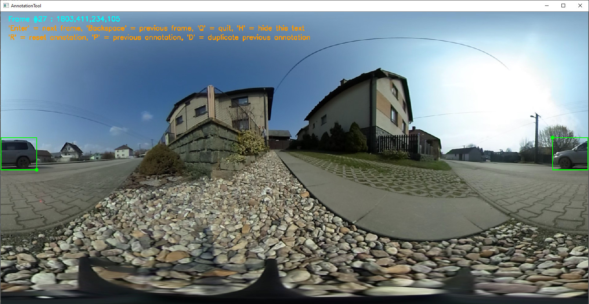

## 360Tracking - code package

The source code of this work has very simple python package structure. You could experiment with OpenCV trackers (or with some advanced trackers), simple annotation tool and modules for evaluation.

#### opencv_tracking

If you have installed the necessary packages you should be able to run OpenCV trackers with custom improvements for object tracking in equirectangular panorama.

```
$360Tracking/code/

# runs CSRT tracker and you could select ROI of the tracked object
python run_opencv_tracking.py -t CSRT -v annotation/dataset-demo/demo-annotation/demo.mp4

# runs CSRT tracker with BORDER improvement and you could select ROI of the tracked object
python run_opencv_tracking.py -t CSRT -v annotation/dataset-demo/demo-annotation/demo.mp4 -border

# runs CSRT tracker with NFOV improvement and you could select ROI of the tracked object
python run_opencv_tracking.py -t CSRT -v annotation/dataset-demo/demo-annotation/demo.mp4 -nfov

# runs CSRT tracker initialized on the first frame of groundtruth data
python run_opencv_tracking.py -t CSRT -v annotation/dataset-demo/demo-annotation/demo.mp4 -gt annotation/dataset-demo/demo-annotation/groundtruth.txt

# runs CSRT tracker initialized on the first frame of groundtruth data and creates file with tracker results
python run_opencv_tracking.py -t CSRT -v annotation/dataset-demo/demo-annotation/demo.mp4 -gt annotation/dataset-demo/demo-annotation/groundtruth.txt -r annotation/dataset-demo/demo-result/tmp-result.txt
```


#### pytracking

If you have successfully installed [pytracking](https://github.com/visionml/pytracking), you could try the following commands.

```
$360Tracking/code/

# runs ATOM tracker with default network and you could select ROI of the tracked object
python pytracking/pytracking/run_video_360.py atom default annotation/dataset-demo/demo-annotation/demo.mp4

# runs DiMP tracker with default network and you could select ROI of the tracked object
python pytracking/pytracking/run_video_360.py dimp dimp50 annotation/dataset-demo/demo-annotation/demo.mp4

# runs KYS tracker with default network and you could select ROI of the tracked object
python pytracking/pytracking/run_video_360.py kys default annotation/dataset-demo/demo-annotation/demo.mp4

# runs ECO tracker with default network and you could select ROI of the tracked object
python pytracking/pytracking/run_video_360.py eco default annotation/dataset-demo/demo-annotation/demo.mp4

# Other flags and arguments are exactly the same as in opencv_tracking mentioned above. 
# Flag -border enables BORDER improvement and flag -nfov enables NFOV improvement.
# Parameter -gt/-groundtruth specifies groundtruth data file and -r/--result specifies result file to be created.
```


#### DaSiamRPN

If you have successfully installed [DaSiamRPN](https://github.com/foolwood/DaSiamRPN), you could try the following commands.

```
$360Tracking/code/

# runs DaSiamRPN tracker with downloaded network and you could select ROI of the tracked object
python DaSiamRPN/code/run_video_360.py -v annotation/dataset-demo/demo-annotation/demo.mp4

# Other flags and arguments are exactly the same as in opencv_tracking mentioned above. 
# Flag -border enables BORDER improvement and flag -nfov enables NFOV improvement.
# Parameter -gt/-groundtruth specifies groundtruth data file and -r/--result specifies result file to be created.
```


#### TracKit

If you have successfully installed [TracKit](https://github.com/researchmm/TracKit), you could try the following commands.

```
$360Tracking/code/

# runs SiamDW tracker with downloaded network and you could select ROI of the tracked object
python TracKit/tracking/run_video_360.py --arch Ocean --resume TracKit/snapshot/OceanV19on.pth -v annotation/dataset-demo/demo-annotation/demo.mp4

# runs Ocean tracker with downloaded network and you could select ROI of the tracked object
python TracKit/tracking/run_video_360.py --arch SiamDW --resume TracKit/snapshot/siamdw_res22w.pth -v annotation/dataset-demo/demo-annotation/demo.mp4

# Other flags and arguments are exactly the same as in opencv_tracking mentioned above. 
# Flag -border enables BORDER improvement and flag -nfov enables NFOV improvement.
# Parameter -gt/-groundtruth specifies groundtruth data file and -r/--result specifies result file to be created.
```


#### annotation_tool

You could a simple annotation tool that enables annotation on the borders of equirectangular frames as you can see below. The annotation tool uses OpenCV mouse and keyboard events. It has been used to create the new [dataset](https://drive.google.com/drive/folders/13tkE4vY3FGGD42kDIjyS9K423vrvpKoU?usp=sharing).

<p align="center">
    
</p>

```
$360Tracking/code/

# run annotation tool without existing groundtruth data
python run_annotation_tool.py -v annotation/dataset-demo/demo-annotation/demo.mp4

# run annotation tool with existing groundtruth data - parse groundtruth and possible update
python run_annotation_tool.py -v annotation/dataset-demo/demo-annotation/demo.mp4 -gt annotation/dataset-demo/demo-annotation/groundtruth.txt
```


If you have not downloaded the [dataset](https://drive.google.com/drive/folders/13tkE4vY3FGGD42kDIjyS9K423vrvpKoU?usp=sharing) yet, you can download it using the following script. Make sure if "./annotation/dataset/" directory has been created after the download process ends.

```
bash script_dataset_download.sh
```


#### draw_annotation

You could also draw groundtruth annotations in dataset sequence. 

```
$360Tracking/code/

# drawing demo annotations
python run_draw_annotation.py --demo

# drawing annotations in video frames in given dataset directory (if you have downloaded dataset)
python run_draw_annotation.py -dir annotation/dataset/03
```


#### evaluation

You could perform also an evaluation using implemented modules.

```
$360Tracking/code/

# running demo evaluation - just show groundtruth and result data
python run_evaluation.py -demo

# run drawing for given video, groundtruth and result data
python run_evaluation.py -v annotation/dataset/01/01.mp4 -gt annotation/dataset/01/groundtruth.txt -r annotation/results/CSRT/01/01-result-border.txt

# run computing Intersection over Union metric (-iou flag)
python run_evaluation.py -video annotation/dataset/01/01.mp4 -gt annotation/dataset/01/groundtruth.txt -result annotation/results/CSRT/01/01-result-border.txt -iou

# run computing Location/Center error metric (-centererror flag)
python run_evaluation.py -v annotation/dataset/01/01.mp4 -gt annotation/dataset/01/groundtruth.txt -r annotation/results/CSRT/01/01-result-default.txt -centererror

# you can create plots for metrics that you have just computed
python run_evaluation_plots.py -success -t CSRT -n 01
python run_evaluation_plots.py -precision -t CSRT -n 01
```


##### 
